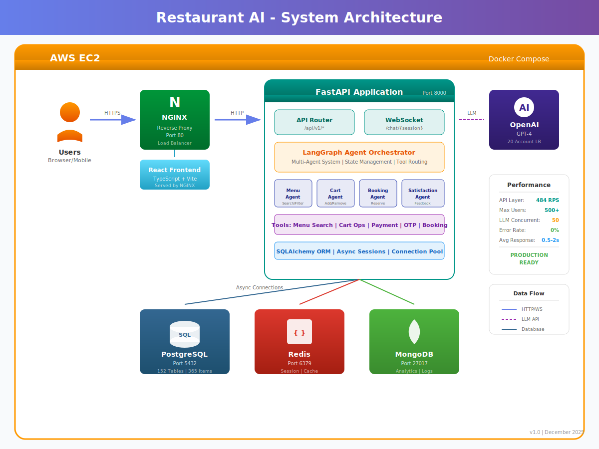
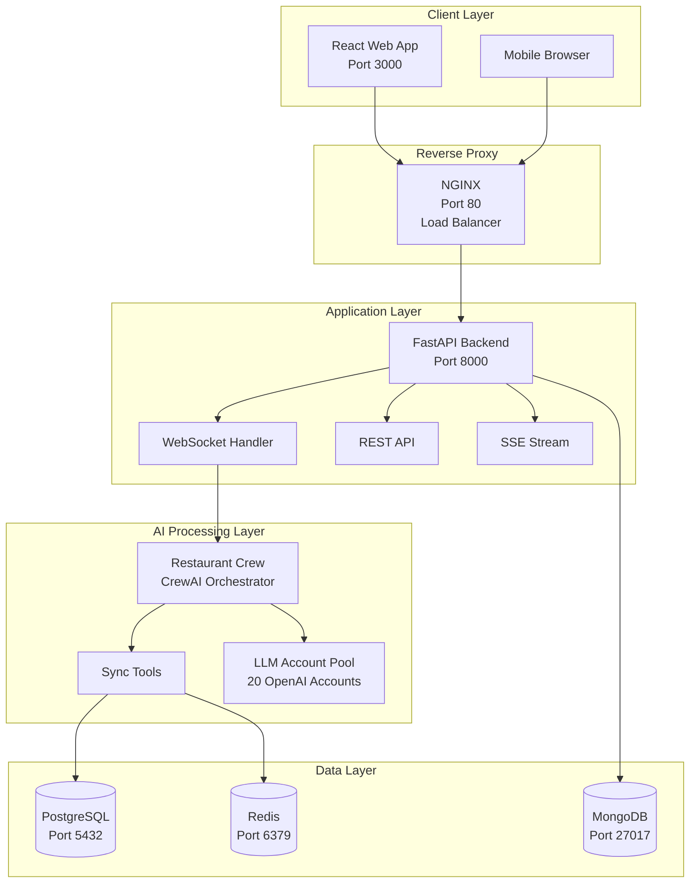
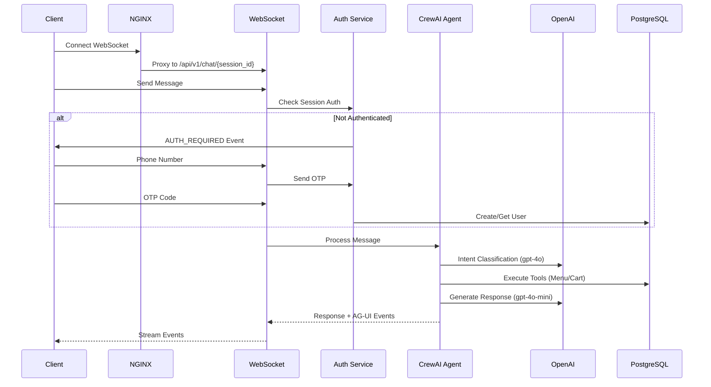
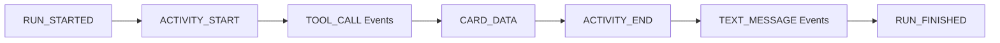
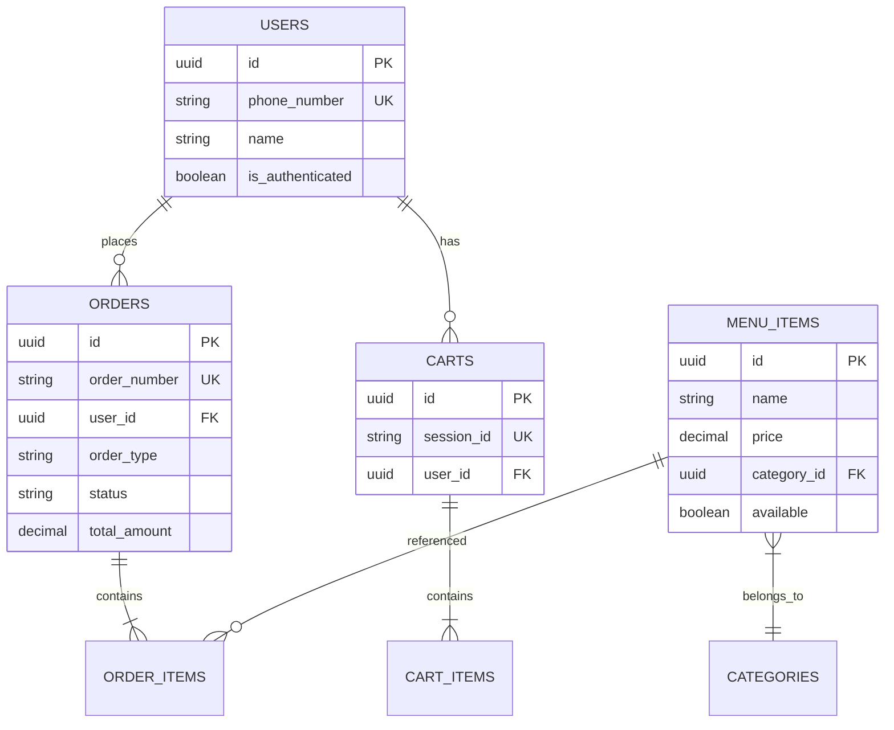
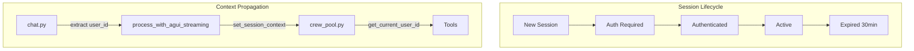
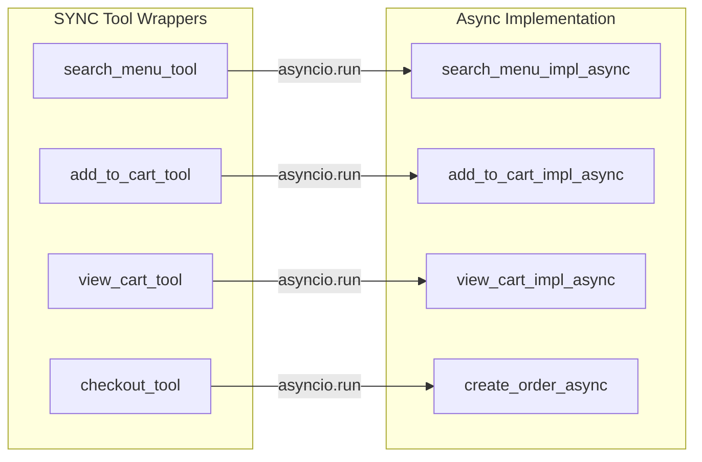
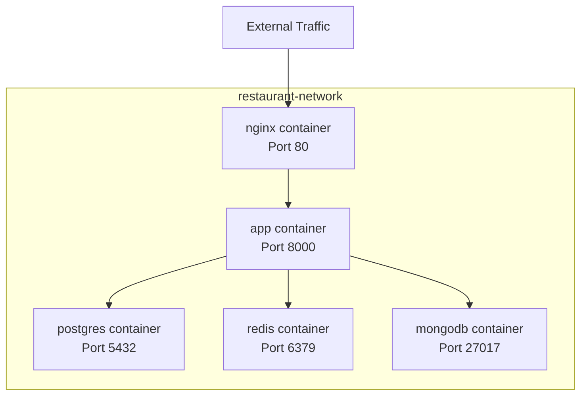
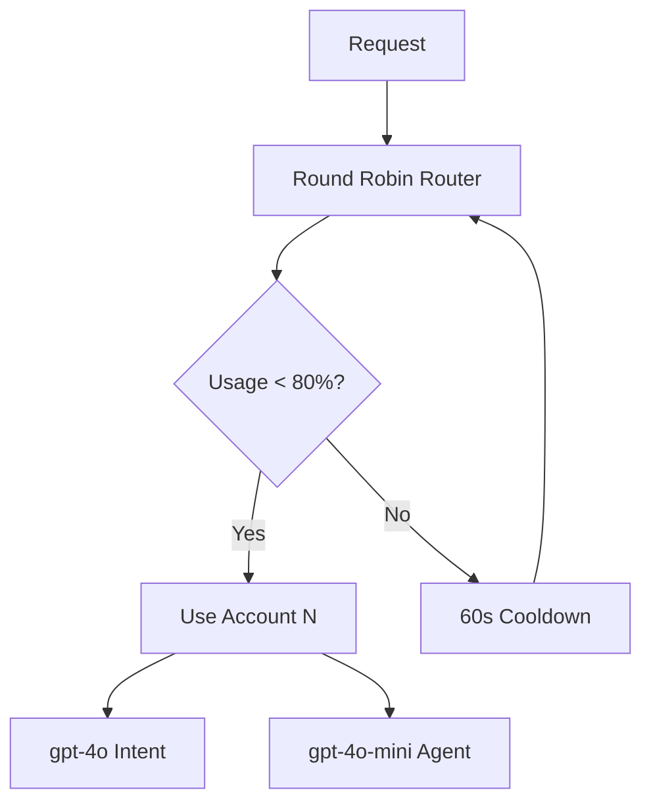

# Restaurant AI Assistant - System Architecture

## Visual Architecture



*Click image to view full size. For detailed component descriptions, see sections below.*

### Detailed Architecture Diagrams

| Diagram | Description | Link |
|---------|-------------|------|
| **Request Flow** | End-to-end message journey through all layers | [View](./diagrams/01-request-flow.svg) |
| **Agent Architecture** | CrewAI multi-agent system & tool layer | [View](./diagrams/02-agent-architecture.svg) |
| **Database Schema** | PostgreSQL, Redis, MongoDB schemas | [View](./diagrams/03-database-schema.svg) |
| **Authentication Flow** | OTP-based phone verification flow | [View](./diagrams/04-auth-flow.svg) |
| **Deployment Architecture** | AWS EC2 + Docker Compose setup | [View](./diagrams/05-deployment.svg) |

*All diagrams are SVG (vector) format - click to view full size, zoom infinitely.*

---

## Performance Summary (December 2025)

| Metric | Result | Status |
|--------|--------|--------|
| **API Throughput** | 484 req/sec | EXCELLENT |
| **Max Concurrent Users** | 500+ tested | NO ERRORS |
| **LLM Concurrent Calls** | 50 tested | 0% ERROR RATE |
| **Average Response** | 0.5-2.0s | GOOD |

*Full load test report: [LOAD_TEST_REPORT.md](./LOAD_TEST_REPORT.md)*

---

## Quick Start - One Command Deployment

```bash
# 1. Clone and enter directory
git clone <repository-url>
cd codebase

# 2. Configure environment
cp .env.example .env
# Edit .env and add your OPENAI_API_KEY

# 3. Deploy everything with ONE command
docker compose up -d --build

# That's it! Access at:
# - Frontend: http://localhost
# - API: http://localhost:8000
# - API Docs: http://localhost:8000/docs
```

### Helper Scripts
```bash
# Linux/Mac
./deploy.sh          # Deploy all services
./deploy.sh down     # Stop all services
./deploy.sh logs     # View logs

# Windows
deploy.bat           # Deploy all services
deploy.bat down      # Stop all services
deploy.bat logs      # View logs
```

---

## High-Level Architecture



## Request Flow



## AG-UI Event Flow



### Card Types
- **MENU_CARD**: Display menu items with images, prices
- **CART_CARD**: Shopping cart with items, quantities, totals
- **ORDER_DATA**: Order confirmation with order number
- **AUTH_REQUIRED**: Phone/OTP authentication form

## Database Schema



## Session Context Architecture



## CrewAI Tool Architecture

**IMPORTANT**: CrewAI does not properly await async tools even with .
All tools MUST be SYNC functions that internally call async code via .



## Docker Architecture



## LLM Load Balancing



## File Structure

```
codebase/
├── app/
│   ├── api/routes/
│   │   ├── chat.py              # WebSocket handler
│   │   ├── stream.py            # SSE streaming
│   │   ├── menu.py              # Menu REST API
│   │   └── orders.py            # Orders REST API
│   ├── core/
│   │   ├── agui_events.py       # AG-UI event system
│   │   ├── config.py            # Configuration
│   │   └── database.py          # DB connections
│   ├── features/food_ordering/
│   │   ├── crew_agent.py        # CrewAI agent + tools
│   │   └── services/            # Business logic
│   ├── orchestration/
│   │   └── restaurant_crew.py   # Main orchestrator
│   └── services/
│       ├── crew_pool.py         # CrewAI pool + context
│       └── identity_service.py  # Auth service
├── frontend/
│   ├── src/
│   │   ├── components/          # React components
│   │   ├── hooks/useWebSocket.js
│   │   └── pages/
│   └── package.json
├── docker/
│   ├── docker-compose.yml
│   ├── Dockerfile               # Backend
│   └── Dockerfile.nginx         # Frontend + proxy
├── db/
│   ├── init.sql
│   ├── 01-schema.sql
│   └── 02-data.sql
├── docs/
│   ├── ARCHITECTURE.md           # This file
│   ├── architecture.svg          # Visual system diagram
│   ├── LOAD_TEST_REPORT.md       # Performance testing results
│   └── EC2_DEPLOY.md             # AWS deployment guide
├── load_test.py                  # Basic load test
├── load_test_full.py             # Multi-endpoint load test
├── load_test_api.py              # API discovery + testing
└── load_test_extreme.py          # Stress testing script
```

## Key Technical Decisions

1. **Sync Tools for CrewAI**: CrewAI cannot properly handle async tools. All tools are sync wrappers around async implementations.

2. **Session Context via ContextVar**: User ID and session ID are propagated through ContextVar for thread-safe access in tools.

3. **AG-UI Protocol**: Real-time streaming events for typing indicators, tool progress, and card data.

4. **20-Account LLM Pool**: Round-robin load balancing across multiple OpenAI accounts for high throughput.

5. **Docker Compose Orchestration**: All services in single network with health checks and proper startup order.
