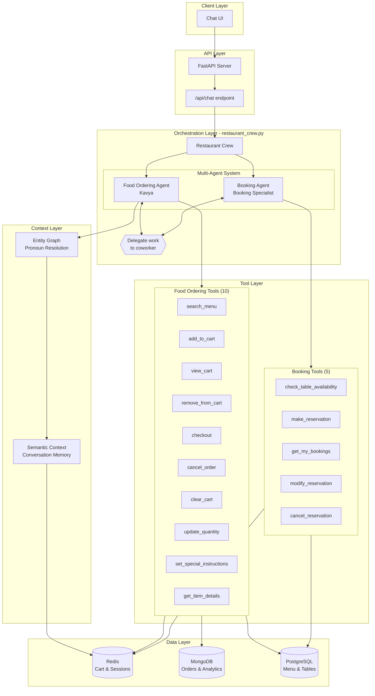
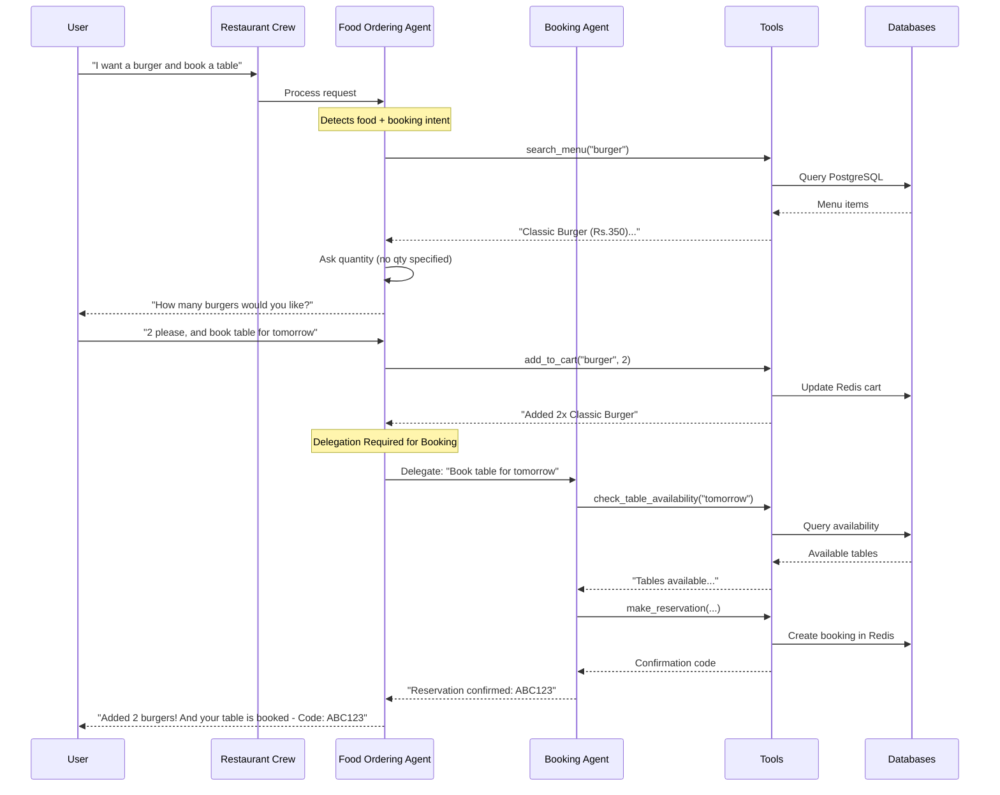
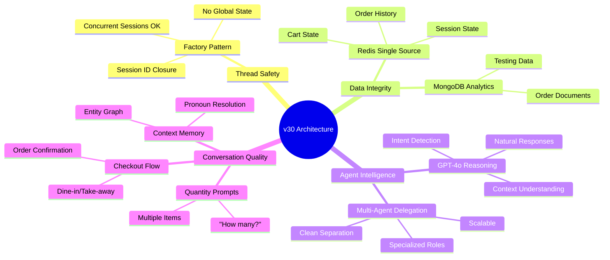
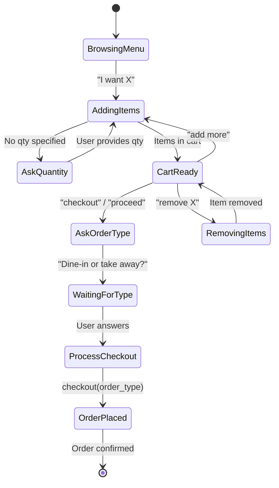
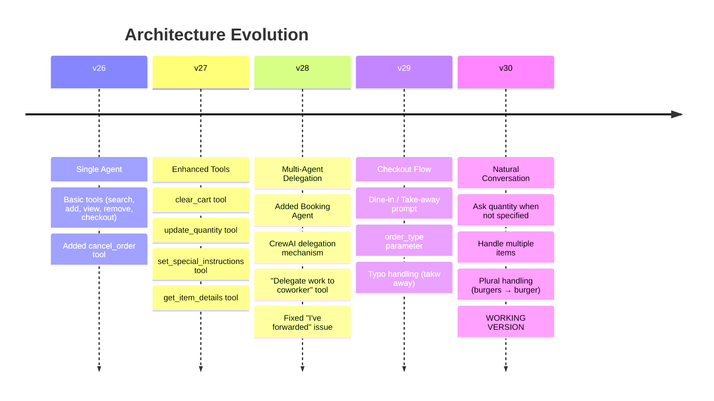
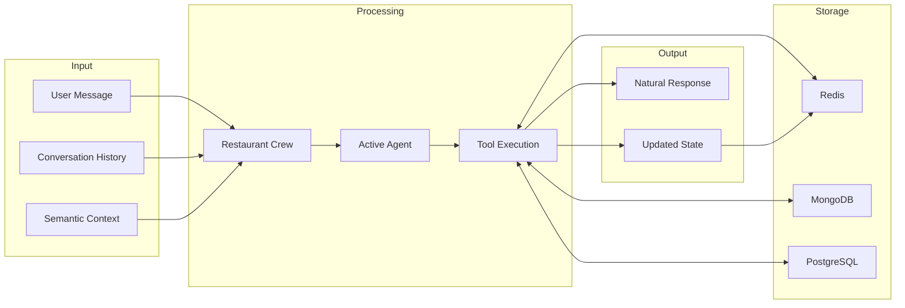
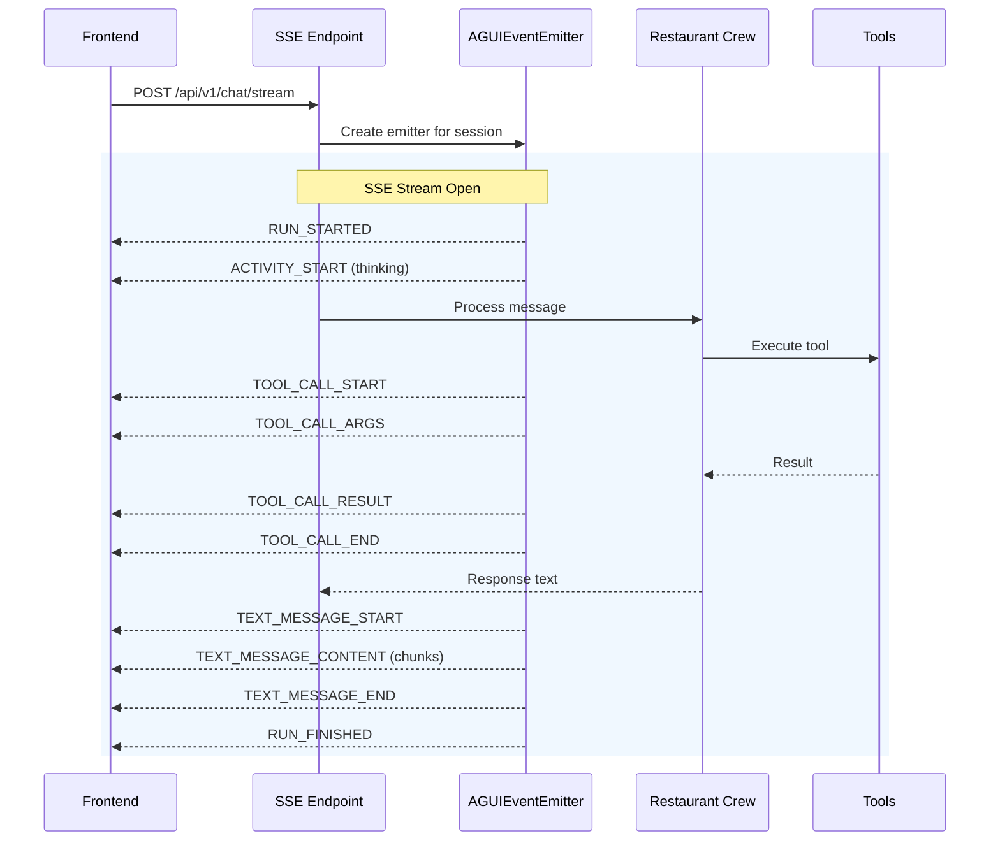

# Restaurant AI Architecture v30
## Multi-Agent Crew with Delegation

### High-Level Architecture



---

### Agent Delegation Flow



---

### Why This Architecture is Optimal



---

### Tool Factory Pattern (Thread Safety)

```mermaid
flowchart LR
    subgraph "Session A"
        SA[session_id: "abc123"]
        TA[Tools with abc123 closure]
    end

    subgraph "Session B"
        SB[session_id: "xyz789"]
        TB[Tools with xyz789 closure]
    end

    subgraph "Factory Functions"
        F1[create_add_to_cart_tool]
        F2[create_checkout_tool]
        F3[create_view_cart_tool]
    end

    SA --> F1 --> TA
    SA --> F2 --> TA
    SA --> F3 --> TA

    SB --> F1 --> TB
    SB --> F2 --> TB
    SB --> F3 --> TB

    subgraph "Redis (Isolated)"
        RA[cart:abc123]
        RB[cart:xyz789]
    end

    TA --> RA
    TB --> RB
```

---

### Checkout Flow (v29+)



---

### Evolution to v30



---

### Key Design Decisions

| Decision | Why It's Best | Alternative Rejected |
|----------|--------------|---------------------|
| **Multi-Agent with Delegation** | Clean separation of concerns, specialized agents | Single agent with all tools (harder to maintain) |
| **Factory Pattern for Tools** | Thread-safe, session isolation | Global tools (race conditions) |
| **Redis for Cart State** | Fast, single source of truth | In-memory (lost on restart) |
| **GPT-4o for Reasoning** | Better context understanding | GPT-3.5 (misses nuance) |
| **Entity Graph** | Pronoun resolution ("it", "the 2nd one") | No context (repetitive questions) |
| **Sequential Process** | Predictable flow with delegation | Hierarchical (over-complex) |
| **Quantity Prompts** | Natural conversation flow | Auto-assume 1 (not user-friendly) |
| **Checkout Flow** | Matches real restaurant UX | Direct checkout (missing info) |

---

### Data Flow Summary



---

## AG-UI Protocol Integration (v31)

### Real-Time Streaming Architecture



### AG-UI Event Types

| Event | Purpose | When Emitted |
|-------|---------|--------------|
| `RUN_STARTED` | Processing begins | Start of request |
| `ACTIVITY_START` | Show typing indicator | Thinking, searching |
| `ACTIVITY_END` | Hide indicator | Activity complete |
| `TOOL_CALL_START` | Tool execution begins | Before tool runs |
| `TOOL_CALL_ARGS` | Show tool arguments | With tool start |
| `TOOL_CALL_RESULT` | Tool output | After execution |
| `TOOL_CALL_END` | Tool complete | After result |
| `TEXT_MESSAGE_START` | Response begins | Before streaming |
| `TEXT_MESSAGE_CONTENT` | Text chunk | During streaming |
| `TEXT_MESSAGE_END` | Response complete | After all text |
| `RUN_FINISHED` | Processing done | End of request |
| `RUN_ERROR` | Error occurred | On failure |

### User Experience Enhancement

```
Before AG-UI:                    With AG-UI:
+------------------+             +------------------+
| [User sends msg] |             | [User sends msg] |
|                  |             |                  |
| [2-3 sec wait]   |             | "Thinking..."    |
|                  |             | "Searching menu" |
|                  |             | "Adding to cart" |
| [Full response]  |             | [Streamed text]  |
+------------------+             +------------------+
```

### Endpoints

| Endpoint | Method | Description |
|----------|--------|-------------|
| `/api/v1/chat/stream` | POST | Process message with SSE streaming |
| `/api/v1/chat/stream/{session_id}` | GET | Connect to existing session stream |

### Frontend Integration Example

```javascript
// Connect to AG-UI stream
const response = await fetch('/api/v1/chat/stream', {
    method: 'POST',
    headers: { 'Content-Type': 'application/json' },
    body: JSON.stringify({
        message: "I want a burger",
        session_id: "session-123"
    })
});

const reader = response.body.getReader();
const decoder = new TextDecoder();

while (true) {
    const { value, done } = await reader.read();
    if (done) break;

    const lines = decoder.decode(value).split('\n');
    for (const line of lines) {
        if (line.startsWith('data: ')) {
            const event = JSON.parse(line.slice(6));

            switch (event.type) {
                case 'ACTIVITY_START':
                    showTypingIndicator(event.message);
                    break;
                case 'TEXT_MESSAGE_CONTENT':
                    appendText(event.delta);
                    break;
                case 'RUN_FINISHED':
                    hideTypingIndicator();
                    break;
            }
        }
    }
}
```

---

## Quick Reference

**Tag:** `v30-working`

**Restore:** `git checkout v30-working`

**Key Files:**
- `app/orchestration/restaurant_crew.py` - Main orchestrator
- `app/features/food_ordering/crew_agent.py` - Food tools (10)
- `app/features/booking/crew_agent.py` - Booking tools (5) - PostgreSQL integrated
- `app/core/semantic_context.py` - Entity graph
- `app/core/redis.py` - Cart & session state
- `app/core/db_pool.py` - PostgreSQL connection pool
- `app/core/agui_events.py` - AG-UI event emitter
- `app/api/routes/stream.py` - SSE streaming endpoint
