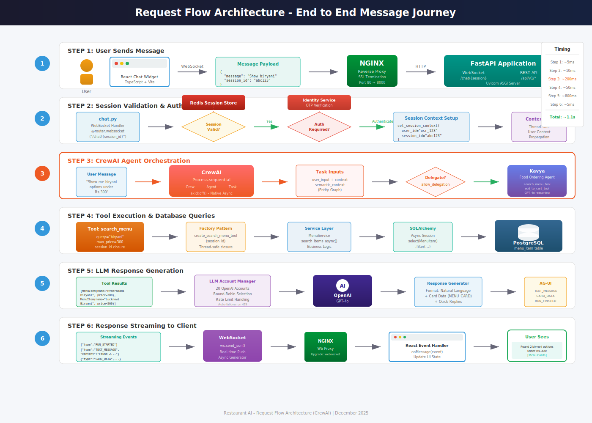
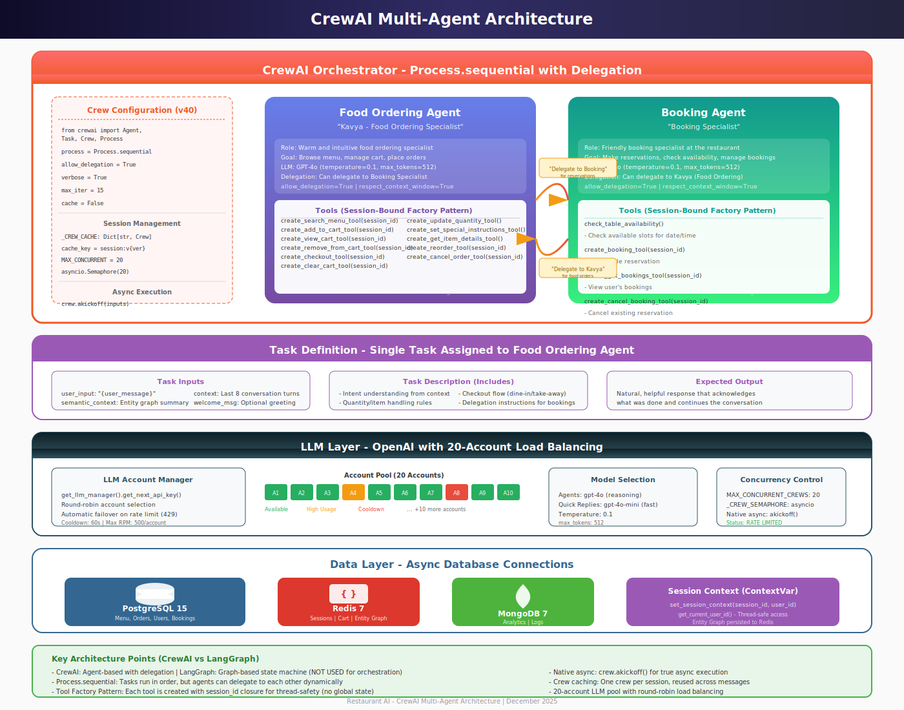
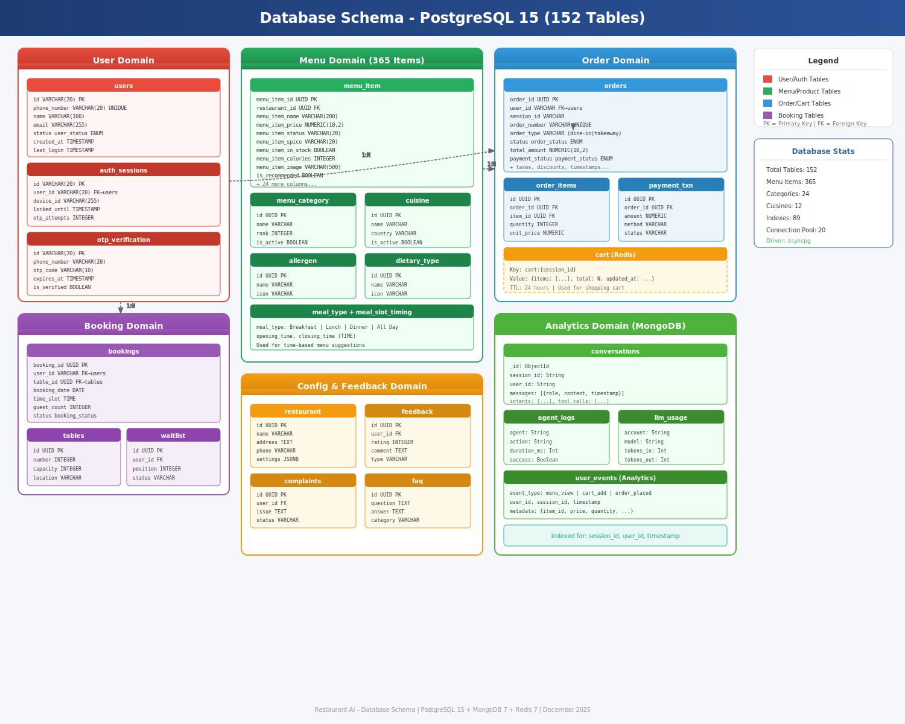
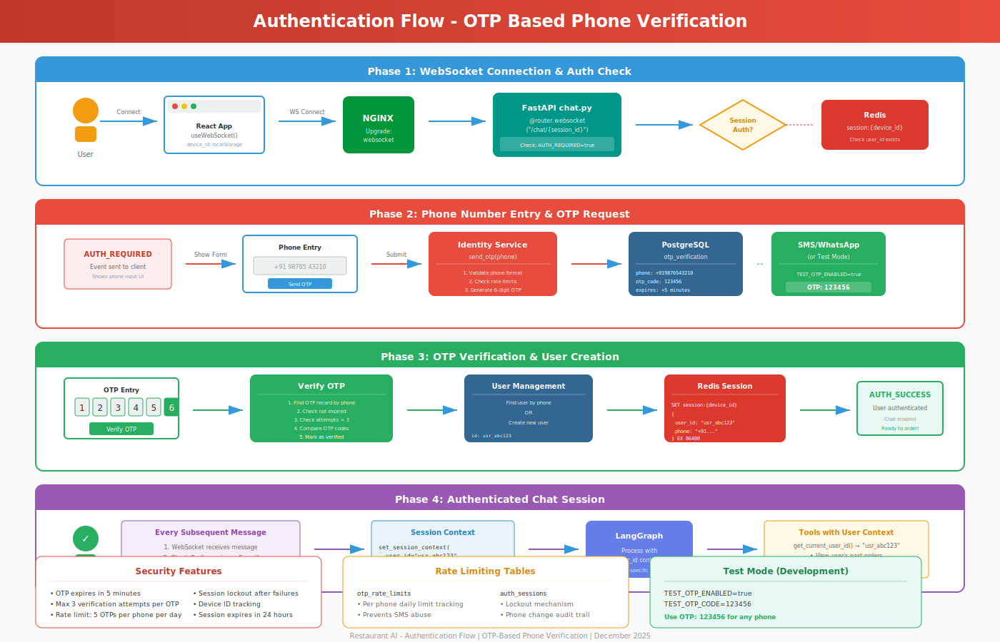

# Architecture Diagrams

This directory contains detailed SVG architecture diagrams for the Restaurant AI system.

## Diagram Index

### 1. Request Flow

**File:** [01-request-flow.svg](./01-request-flow.svg)

Complete end-to-end journey of a user message through the system:
- WebSocket connection through NGINX
- Session validation and authentication check
- LangGraph agent orchestration
- Tool execution and database queries
- LLM response generation
- Streaming response back to client

---

### 2. Agent Architecture

**File:** [02-agent-architecture.svg](./02-agent-architecture.svg)

LangGraph multi-agent system details:
- StateGraph orchestrator
- Intent router with GPT-4o classification
- Specialized agents (Menu, Cart, Booking, Feedback, General)
- Tool layer with database access
- LLM layer with 20-account load balancing

---

### 3. Database Schema

**File:** [03-database-schema.svg](./03-database-schema.svg)

Complete database schema across all data stores:
- PostgreSQL: 152 tables (Users, Menu, Orders, Bookings, Config)
- Redis: Sessions, Cart, Cache
- MongoDB: Analytics, Logs, Conversations

---

### 4. Authentication Flow

**File:** [04-auth-flow.svg](./04-auth-flow.svg)

OTP-based phone verification flow:
- Phase 1: WebSocket connection & auth check
- Phase 2: Phone number entry & OTP request
- Phase 3: OTP verification & user creation
- Phase 4: Authenticated session management
- Security features and rate limiting

---

### 5. Deployment Architecture

**File:** [05-deployment.svg](./05-deployment.svg)

AWS EC2 + Docker Compose deployment:
- EC2 instance configuration
- Docker Compose with 5 containers
- Container dependencies and health checks
- Persistent volumes
- External service integrations

---

## Technical Notes

### SVG Advantages
- **Scalable**: Vector graphics that look crisp at any size
- **GitHub Native**: Renders directly in GitHub markdown
- **Editable**: Can be modified with any text editor
- **Lightweight**: Small file sizes (~20-40KB each)
- **Accessible**: Text content is searchable

### Viewing Diagrams
1. **GitHub**: Click on any `.svg` file to view full-size
2. **Browser**: Open directly in Chrome/Firefox/Safari
3. **VS Code**: Install SVG Preview extension
4. **Figma/Illustrator**: Import for editing

### Color Coding
| Color | Meaning |
|-------|---------|
| Blue | Network/API layer |
| Green | Success/Health/Database |
| Red | Auth/Security |
| Orange | Configuration/Warnings |
| Purple | AI/LLM components |

---

*Generated: December 2025*
